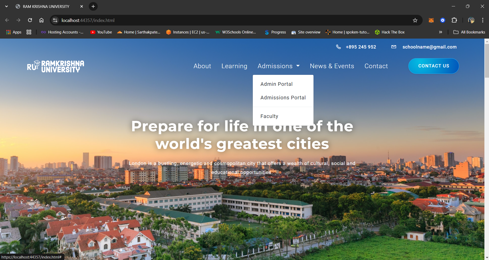
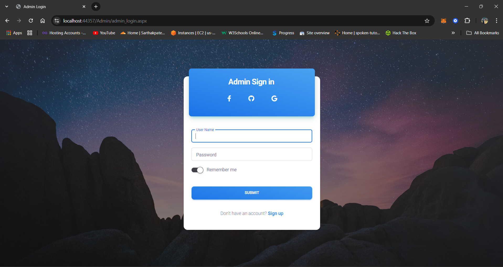
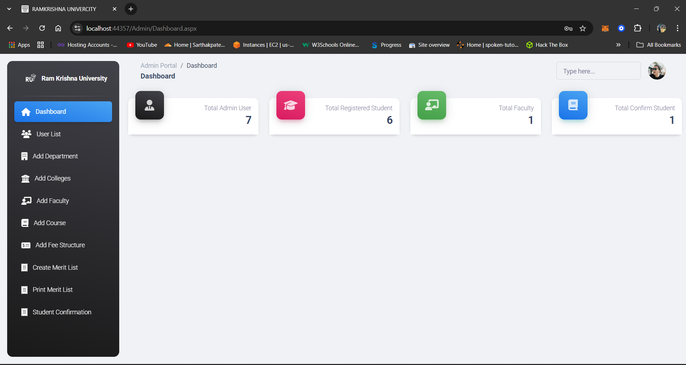
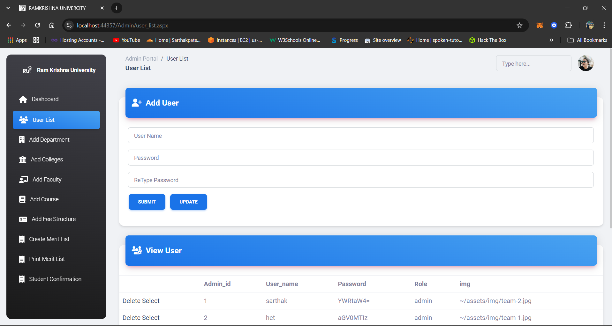
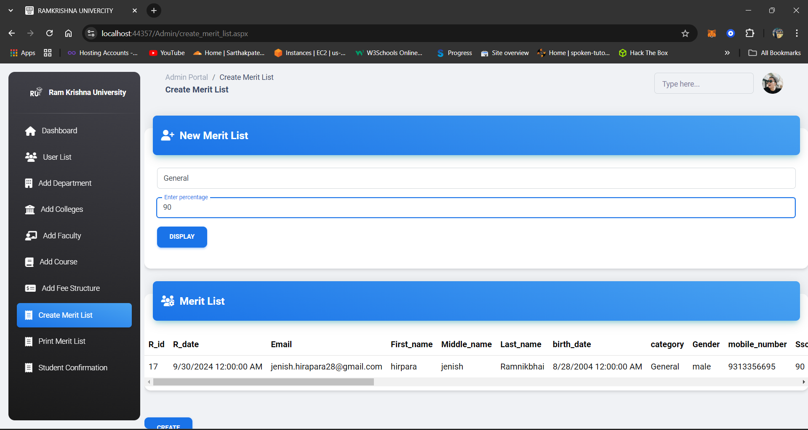
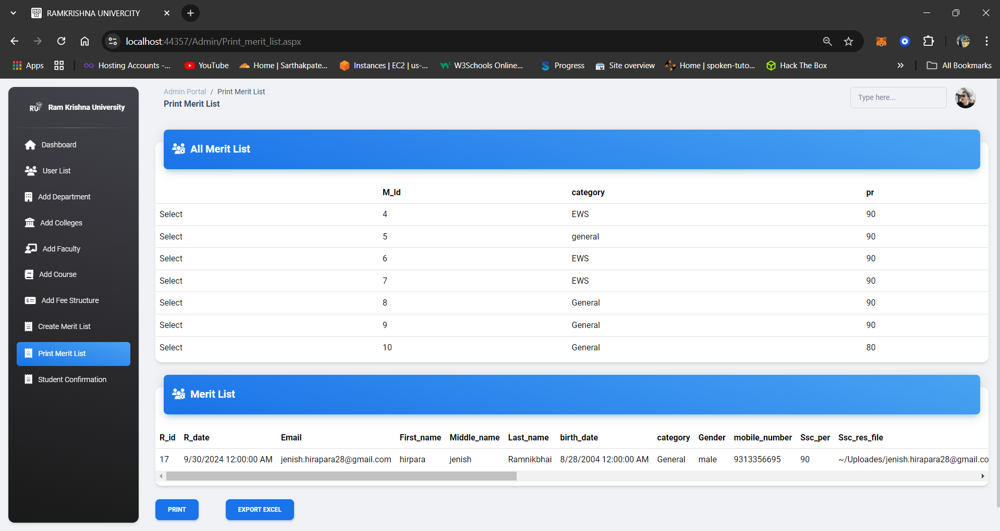
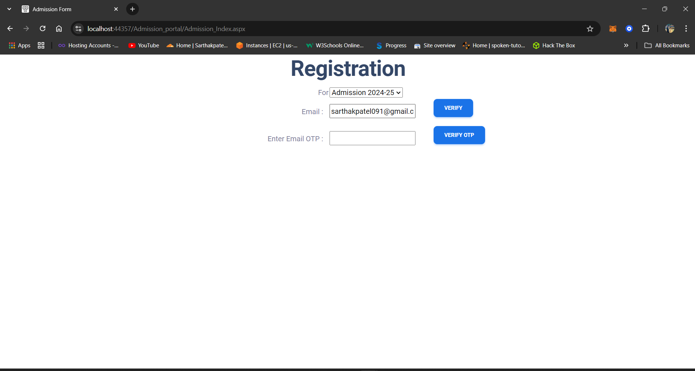
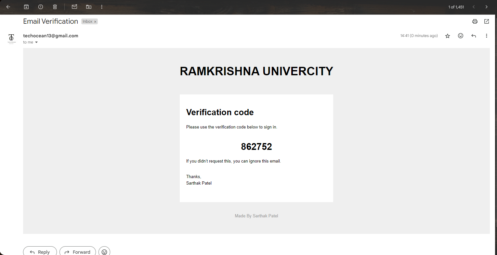
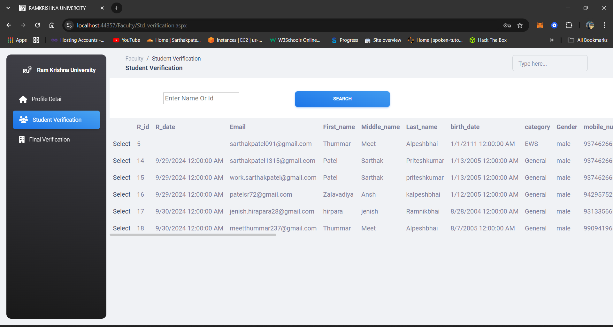
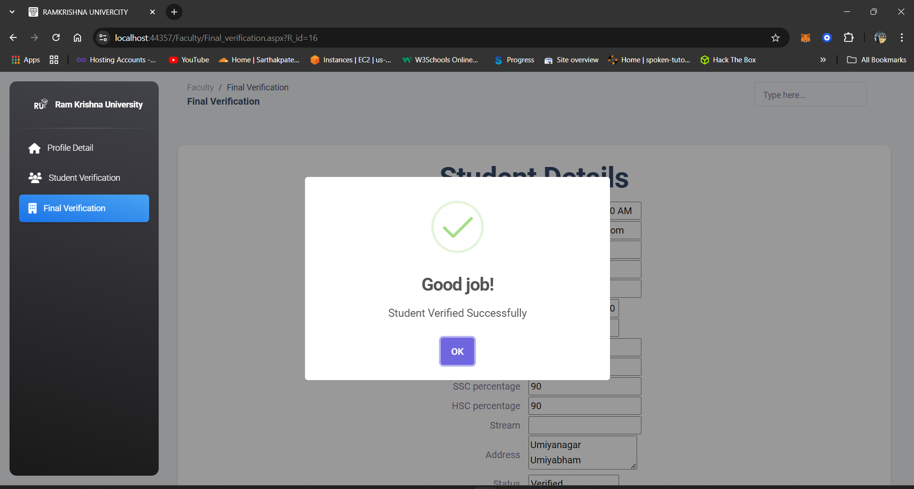

# **Student Admission Management System**

---


#### Overview:
The **Student Admission Management System** is an ASP.NET-based web application designed to manage the entire student admission process, from registration to final enrollment. This project features various modules that streamline the operations of both administrators and faculty members. The system also includes a secure OTP verification mechanism and data encryption for safe and secure transactions.

---


### Key Modules:

1. **Admin Module**:
   - **Department Management**: Manage departments and faculty members.
   - **Course Management**: Create, update, and manage course offerings.
   - **Fee Structure Setup**: Define fees for various programs and categories.
   - **User Access Control**: Set user roles and permissions.
   - **Merit List Generation**: Automatically generate merit lists based on predefined criteria.
   - **Print and Confirm Student Lists**: Handle the confirmation and printing of student records.

2. **Admission Module**:
   - **Application Submission**: Allows students to submit applications online.
   - **Application Processing**: Admin reviews and updates the status of the applications.
   - **Document Verification**: Faculty and admins verify the uploaded student documents.

3. **Faculty Portal**:
   - **Student Evaluation**: Grade student work and provide feedback.
   - **Course Management**: Upload course materials like syllabi, assignments, and other resources.
   - **Communication**: Facilitate communication with students and access announcements.
   - *Note*: Some functionalities are planned for future versions, such as deeper course management.

4. **Student Portal** (Future Module):
   - **Academic Information**: Provides students access to course schedules, grades, and results.
   - **Financial Management**: Allows students to view fee details, make payments, and track their transactions.
   - **Communication and Support**: Enables students to connect with faculty and staff.

---

#### Features:
- **User Authentication**: Secure login mechanisms for Admin, Faculty, and Students.
- **OTP System**: Implemented using the `Sender.cs` page to ensure the legitimacy of student registrations.
- **Database Management**: Efficient handling of student data, stored securely in the database.
- **Email Notification**: The system uses `Sender.cs` to send automated notifications to users, including OTPs and important updates.
- **Encryption**: Secure data transmission using the `enc.cs` class for encryption mechanisms.
- **Responsive UI**: The system utilizes CSS for a user-friendly and responsive design across multiple devices.

---

#### Project Structure:

- **Admin/**: Contains pages and functionalities related to the Admin module.
- **Admission_portal/**: Contains pages and code for the student admission process.
- **Faculty/**: Faculty-specific functionalities.
- **App_Data/**: Contains database files and configurations.
- **Assets/**, **img/**, **css/**: Static resources such as stylesheets and images.
- **Global.asax**: Handles global application-level events and session management.
- **DB.cs**: Handles database interactions.
- **enc.cs**: Manages encryption for data security.
- **Sender.cs**: Manages sending of emails or SMS for OTPs and notifications.

---

#### Installation and Setup:

1. **Clone the repository**:
   ```bash
   git clone <repository-url>
   ```

2. **Open the solution in Visual Studio**:
   - Open `rku_system.sln` in Visual Studio.

3. **Database Setup**:
   - Place the database files in the `App_Data` folder.
   - Configure your database connection string in `Web.config`.

4. **Build and Run**:
   - Build the solution using Visual Studio.
   - Run the project on your local IIS server or a web host.

---

#### Requirements:

- **Visual Studio**: Version 2019 or later.
- **SQL Server**: For database management.
- **ASP.NET Framework**: Version 4.7 or higher.
- **SMTP Server**: For email functionality.

---

#### Screenshots:
- **Database Schema**: The system's database structure is represented visually in .
- **Presentation**: Refer to [`Student-Admission-Management-System.pptx`](https://github.com/Sarthak1315/Student-Admission-Management-System/blob/main/Student-Admission-Management-System.pptx) for a complete project overview and documentation.

 











---

#### Future Enhancements:
- Integration with mobile platforms for easier student access.
- Multi-language support for broader accessibility.
- Real-time notifications for admission updates and status changes.

---

## Author

Student Admission Management System was developed by [Sarthak Patel](http://github.com/Sarthak1315) , [Het Goti](https://github.com/het0807) , [Meet thummar](https://github.com/Meet696) And [Pratham Katrodiya](https://github.com/pratham-katrodiya).

Connect with Sarthak Patel:

[](https://github.com/Sarthak1315)
[](https://www.linkedin.com/in/sarthak-patel-sp1315/)
[](https://www.instagram.com/___sarthak_13/)
[](mailto:work.sarthakpatel@gmail.com)

---
